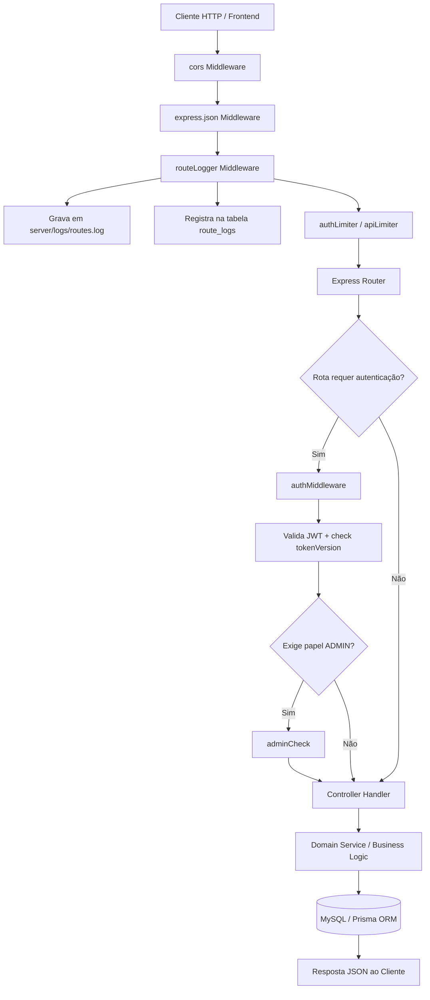

# 5) Mapeamento de Rotas e Middlewares da API

Este documento detalha o fluxo de execução das requisições HTTP, a arquitetura de middlewares e o mapeamento completo de todas as rotas públicas e autenticadas da API REST do **StockSaaS**.

---

## 1. Cadeia de Execução (Request Lifecycle)

Cada requisição HTTP enviada ao backend percorre uma pilha sequencial de middlewares antes de atingir o controller de destino e retornar a resposta em JSON.

### Diagrama de Sequência de uma Requisição

---

## 2. Detalhamento dos Middlewares

| Middleware | Arquivo de Origem | Função |
| :--- | :--- | :--- |
| **`cors`** | `express` (configurado em `src/index.ts`) | Habilita requisições cross-origin para a URL do cliente (`http://localhost:5173`) com suporte a credenciais. |
| **`express.json`** | `express` | Realiza o parse do corpo da requisição em formato JSON (`req.body`). |
| **`routeLogger`** | `src/middleware/routeLogger.ts` | Captura o método HTTP, rota, IP de origem, código de status HTTP, tempo de resposta (ms) e o ID do usuário (se autenticado). Escreve de forma assíncrona no arquivo `server/logs/routes.log` e insere o registro na tabela MySQL `route_logs`. |
| **`authLimiter`** | `src/middleware/rateLimit.ts` | Aplica limite rigoroso de **10 requisições a cada 15 minutos** por IP nas rotas de login e registro (`/api/auth/login` e `/api/auth/register`). |
| **`apiLimiter`** | `src/middleware/rateLimit.ts` | Aplica limite geral de **100 requisições a cada 15 minutos** por IP em todas as demais rotas `/api/*`. O limite é desativado para requisições originadas em `localhost` (`127.0.0.1` / `::1`). |
| **`authMiddleware`** | `src/middleware/auth.ts` | Intercepta requisições protegidas, valida a presença e integridade do token `Bearer` no cabeçalho `Authorization`, e compara a propriedade `tokenVersion` contida no payload do JWT com o registro do usuário no banco. Se o token for inválido, expirado ou revogado (devido à troca de senha), retorna HTTP `401 Unauthorized`. |

---

## 3. Mapeamento Completo de Rotas

---

### 3.1. Autenticação e Perfil (`/api/auth`)

Todas as rotas relativas a autenticação e gestão de perfil de usuário.

| Método | Endpoint | Middlewares | Controller / Handler | Descrição |
| :--- | :--- | :--- | :--- | :--- |
| `POST` | `/api/auth/register` | `routeLogger`, `authLimiter` | `authController.register` | Cadastra um novo usuário no sistema (nome, email, senha). |
| `POST` | `/api/auth/login` | `routeLogger`, `authLimiter` | `authController.login` | Autentica o usuário e retorna o `accessToken` JWT, `refreshToken` e dados do perfil. |
| `POST` | `/api/auth/refresh` | `routeLogger`, `apiLimiter` | `authController.refreshToken` | Emite um novo `accessToken` utilizando um `refreshToken` válido. |
| `GET` | `/api/auth/me` | `routeLogger`, `apiLimiter`, `authMiddleware` | `authController.me` | Retorna as informações do usuário autenticado no momento. |
| `PUT` | `/api/auth/profile` | `routeLogger`, `apiLimiter`, `authMiddleware` | `authController.updateProfile` | Atualiza o nome ou email do usuário autenticado. |
| `PUT` | `/api/auth/password` | `routeLogger`, `apiLimiter`, `authMiddleware` | `authController.changePassword` | Altera a senha do usuário e incrementa `tokenVersion` (invalida tokens anteriores). |

---

### 3.2. Dashboard e Visões Consolidadas (`/api/dashboard`)

Rotas responsáveis por alimentar o painel principal, visões de carteira e gráficos de evolução.

| Método | Endpoint | Middlewares | Controller / Handler | Descrição |
| :--- | :--- | :--- | :--- | :--- |
| `GET` | `/api/dashboard/summary` | `routeLogger`, `apiLimiter`, `authMiddleware` | `dashboardController.getSummary` | Retorna o resumo consolidado de patrimônio total, Renda Variável e Renda Fixa. |
| `GET` | `/api/dashboard/dividends-monthly` | `routeLogger`, `apiLimiter`, `authMiddleware` | `dashboardController.getDividendsMonthly` | Retorna histórico simples de dividendos agrupados por mês. |
| `GET` | `/api/dashboard/dividends-grouped` | `routeLogger`, `apiLimiter`, `authMiddleware` | `dashboardController.getDividendsGrouped` | Retorna dividendos agrupados por `day`, `month` ou `year` com detalhamento de recebidos, pendentes e total. |
| `GET` | `/api/dashboard/closed-positions` | `routeLogger`, `apiLimiter`, `authMiddleware` | `dashboardController.getClosedPositions` | Retorna ativos cuja posição foi zerada (posições encerradas com P/L realizado). |
| `GET` | `/api/dashboard/pnl-overview` | `routeLogger`, `apiLimiter`, `authMiddleware` | `dashboardController.getPnLOverview` | Retorna a visão geral de Lucro/Perda acumulado por ação. |
| `GET` | `/api/dashboard/movements` | `routeLogger`, `apiLimiter`, `authMiddleware` | `dashboardController.getMovements` | Retorna a lista agregada e cronológica de transações e proventos do usuário. |
| `GET` | `/api/dashboard/stock-detail/:ticker` | `routeLogger`, `apiLimiter`, `authMiddleware` | `dashboardController.getStockDetail` | Retorna a visão detalhada de um ticker específico (posição, preço médio, proventos e movimentações). |
| `GET` | `/api/dashboard/stock/:ticker` | `routeLogger`, `apiLimiter`, `authMiddleware` | `dashboardController.getStockDetail` | Alias de acesso direto aos detalhes de uma ação pelo ticker. |
| `GET` | `/api/dashboard/stock/:ticker/evolution` | `routeLogger`, `apiLimiter`, `authMiddleware` | `dashboardController.getStockEvolution` | Retorna a série histórica de evolução de preços, PM e VP nos modos `day` (30d), `month` (12m) e `year`. |

---

### 3.3. Transações de Renda Variável (`/api/transactions`)

Gerenciamento de aportes, compras e vendas de ativos negociados em bolsa.

| Método | Endpoint | Middlewares | Controller / Handler | Descrição |
| :--- | :--- | :--- | :--- | :--- |
| `GET` | `/api/transactions` | `routeLogger`, `apiLimiter`, `authMiddleware` | `transactionController.listTransactions` | Lista as movimentações do usuário com suporte a filtro por ticker ou carteira. |
| `POST` | `/api/transactions` | `routeLogger`, `apiLimiter`, `authMiddleware` | `transactionController.createTransaction` | Cadastra uma nova compra (`BUY`) ou venda (`SELL`) de ação. |
| `PUT` | `/api/transactions/:id` | `routeLogger`, `apiLimiter`, `authMiddleware` | `transactionController.updateTransaction` | Atualiza os dados de uma movimentação existente. |
| `DELETE` | `/api/transactions/:id` | `routeLogger`, `apiLimiter`, `authMiddleware` | `transactionController.deleteTransaction` | Exclui uma movimentação registrada pelo ID. |
| `POST` | `/api/transactions/import-csv` | `routeLogger`, `apiLimiter`, `authMiddleware` | `transactionController.importTransactionsCsv` | Importa em lote transações de compra e venda enviadas via arquivo CSV. |

---

### 3.4. Dividendos e Proventos (`/api/dividends`)

Gestão de dividendos, JCP e rendimentos (automáticos e manuais).

| Método | Endpoint | Middlewares | Controller / Handler | Descrição |
| :--- | :--- | :--- | :--- | :--- |
| `GET` | `/api/dividends` | `routeLogger`, `apiLimiter`, `authMiddleware` | `dividendController.getUserDividends` | Retorna a lista consolidada de proventos calculados com base na data-com da carteira. |
| `GET` | `/api/dividends/stock-dividends` | `routeLogger`, `apiLimiter`, `authMiddleware` | `dividendController.listStockDividends` | Lista os dividendos cadastrados na tabela central global (`StockDividend`). |
| `POST` | `/api/dividends/stock-dividends` | `routeLogger`, `apiLimiter`, `authMiddleware` (Admin) | `dividendController.createStockDividend` | Cadastra um novo dividendo na tabela central global (restrito a `ADMIN`). |
| `PUT` | `/api/dividends/stock-dividends/:id` | `routeLogger`, `apiLimiter`, `authMiddleware` (Admin) | `dividendController.updateStockDividend` | Atualiza um dividendo da tabela central (restrito a `ADMIN`). |
| `DELETE` | `/api/dividends/stock-dividends/:id` | `routeLogger`, `apiLimiter`, `authMiddleware` (Admin) | `dividendController.deleteStockDividend` | Remove um dividendo da tabela central (restrito a `ADMIN`). |
| `POST` | `/api/dividends/stock-dividends/import-csv` | `routeLogger`, `apiLimiter`, `authMiddleware` (Admin) | `dividendController.importStockDividendsCsv` | Importação em lote de dividendos centrais via CSV (restrito a `ADMIN`). |
| `GET` | `/api/dividends/manual` | `routeLogger`, `apiLimiter`, `authMiddleware` | `dividendController.listManualUserDividends` | Lista os proventos lançados manualmente pelo próprio usuário. |
| `POST` | `/api/dividends/manual` | `routeLogger`, `apiLimiter`, `authMiddleware` | `dividendController.createManualUserDividend` | Registra um dividendo manual para o usuário. |
| `PUT` | `/api/dividends/manual/:id` | `routeLogger`, `apiLimiter`, `authMiddleware` | `dividendController.updateManualUserDividend` | Atualiza um dividendo manual cadastrado pelo usuário. |
| `DELETE` | `/api/dividends/manual/:id` | `routeLogger`, `apiLimiter`, `authMiddleware` | `dividendController.deleteManualUserDividend` | Remove um dividendo manual cadastrado pelo usuário. |

---

### 3.5. Renda Fixa e Aportes (`/api/fixed-income`)

Controle de títulos de Renda Fixa (CDB, LCI, LCA, Tesouro, etc.), aportes e encerramentos.

| Método | Endpoint | Middlewares | Controller / Handler | Descrição |
| :--- | :--- | :--- | :--- | :--- |
| `GET` | `/api/fixed-income` | `routeLogger`, `apiLimiter`, `authMiddleware` | `fixedIncomeController.listFixedIncome` | Lista os investimentos de Renda Fixa do usuário com projeções calculadas. |
| `POST` | `/api/fixed-income` | `routeLogger`, `apiLimiter`, `authMiddleware` | `fixedIncomeController.createFixedIncome` | Cadastra um novo título de Renda Fixa. |
| `POST` | `/api/fixed-income/import-csv` | `routeLogger`, `apiLimiter`, `authMiddleware` | `fixedIncomeController.importFixedIncomeCsv` | Importação de títulos de Renda Fixa via CSV. |
| `PUT` | `/api/fixed-income/:id` | `routeLogger`, `apiLimiter`, `authMiddleware` | `fixedIncomeController.updateFixedIncome` | Atualiza as configurações de um título de Renda Fixa. |
| `PATCH` | `/api/fixed-income/:id/settle` | `routeLogger`, `apiLimiter`, `authMiddleware` | `fixedIncomeController.settleFixedIncome` | Registra o encerramento/resgate de um título ou realiza a reabertura do mesmo. |
| `DELETE` | `/api/fixed-income/:id` | `routeLogger`, `apiLimiter`, `authMiddleware` | `fixedIncomeController.deleteFixedIncome` | Remove um título de Renda Fixa e seus aportes vinculados. |
| `POST` | `/api/fixed-income/:id/contributions` | `routeLogger`, `apiLimiter`, `authMiddleware` | `fixedIncomeController.addContribution` | Adiciona um novo aporte a um título de Renda Fixa existente. |
| `PUT` | `/api/fixed-income/:id/contributions/:contributionId` | `routeLogger`, `apiLimiter`, `authMiddleware` | `fixedIncomeController.updateContribution` | Edita o valor ou data de um aporte específico. |
| `DELETE` | `/api/fixed-income/:id/contributions/:contributionId` | `routeLogger`, `apiLimiter`, `authMiddleware` | `fixedIncomeController.deleteContribution` | Remove um aporte de um título de Renda Fixa. |

---

### 3.6. Taxas de Referência (`/api/rates`)

Cadastro e consulta de taxas indexadoras (Selic e IPCA).

| Método | Endpoint | Middlewares | Controller / Handler | Descrição |
| :--- | :--- | :--- | :--- | :--- |
| `GET` | `/api/rates` | `routeLogger`, `apiLimiter`, `authMiddleware` | `rateController.listRates` | Lista o histórico de taxas de referência cadastradas. |
| `GET` | `/api/rates/current` | `routeLogger`, `apiLimiter`, `authMiddleware` | `rateController.getCurrentRates` | Retorna as taxas vigentes no momento para Selic, IPCA e o CDI derivado. |
| `POST` | `/api/rates` | `routeLogger`, `apiLimiter`, `authMiddleware` (Admin) | `rateController.createRate` | Cadastra uma nova taxa de referência (restrito a `ADMIN`). |
| `POST` | `/api/rates/import-csv` | `routeLogger`, `apiLimiter`, `authMiddleware` (Admin) | `rateController.importRatesCsv` | Importação em lote de taxas de referência via CSV (restrito a `ADMIN`). |
| `PUT` | `/api/rates/:id` | `routeLogger`, `apiLimiter`, `authMiddleware` (Admin) | `rateController.updateRate` | Edita uma taxa de referência (restrito a `ADMIN`). |
| `DELETE` | `/api/rates/:id` | `routeLogger`, `apiLimiter`, `authMiddleware` (Admin) | `rateController.deleteRate` | Exclui uma taxa de referência (restrito a `ADMIN`). |

---

### 3.7. Ações e Mercado (`/api/stocks`)

Busca de tickers, cotações em tempo real e utilitários administrativos.

| Método | Endpoint | Middlewares | Controller / Handler | Descrição |
| :--- | :--- | :--- | :--- | :--- |
| `GET` | `/api/stocks` | `routeLogger`, `apiLimiter`, `authMiddleware` | `stockController.listUserStocks` | Lista os ativos que o usuário possui ou já possuiu em carteira. |
| `GET` | `/api/stocks/search` | `routeLogger`, `apiLimiter`, `authMiddleware` | `stockController.searchStocks` | Realiza busca por símbolo/ticker ou nome de ação. |
| `GET` | `/api/stocks/:ticker/quote` | `routeLogger`, `apiLimiter`, `authMiddleware` | `stockController.getStockQuote` | Retorna a cotação atual do ticker informado. |
| `GET` | `/api/stocks/:ticker/dividends-external` | `routeLogger`, `apiLimiter`, `authMiddleware` | `stockController.getExternalDividends` | Consulta histórico de dividendos em APIs de mercado externas. |
| `GET` | `/api/stocks/:ticker/history` | `routeLogger`, `apiLimiter`, `authMiddleware` | `stockController.getStockHistory` | Retorna a série histórica diária de preços do ticker. |
| `GET` | `/api/stocks/admin/api-usage` | `routeLogger`, `apiLimiter`, `authMiddleware` (Admin) | `stockController.getApiUsageStats` | Exibe estatísticas de consumo das APIs Alpha Vantage e Yahoo Finance (restrito a `ADMIN`). |
| `POST` | `/api/stocks/admin/sync-month` | `routeLogger`, `apiLimiter`, `authMiddleware` (Admin) | `stockController.syncMonthPrices` | Força a sincronização manual de cotações mensais para todos os ativos em carteira (restrito a `ADMIN`). |

---

### 3.8. Compartilhamento de Perfil (`/api/shares`)

Geração de links de compartilhamento em modo somente leitura e consulta a carteiras compartilhadas.

| Método | Endpoint | Middlewares | Controller / Handler | Descrição |
| :--- | :--- | :--- | :--- | :--- |
| `GET` | `/api/shares/incoming` | `routeLogger`, `apiLimiter`, `authMiddleware` | `shareController.listIncomingShares` | Lista os perfis de outros usuários compartilhados com o usuário atual. |
| `GET` | `/api/shares/outgoing` | `routeLogger`, `apiLimiter`, `authMiddleware` | `shareController.listOutgoingShares` | Lista os convites de compartilhamento criados pelo usuário atual. |
| `POST` | `/api/shares/outgoing` | `routeLogger`, `apiLimiter`, `authMiddleware` | `shareController.createOutgoingShare` | Gera um novo link e código alfanumérico para compartilhar o perfil com outro e-mail. |
| `POST` | `/api/shares/confirm` | `routeLogger`, `apiLimiter`, `authMiddleware` | `shareController.confirmShare` | Confirma o recebimento de um compartilhamento fornecendo o código de validação. |
| `DELETE` | `/api/shares/:id` | `routeLogger`, `apiLimiter`, `authMiddleware` | `shareController.deleteShare` | Revoga um compartilhamento ativo ou cancela um convite pendente. |
| `GET` | `/api/shares/:id/summary` | `routeLogger`, `apiLimiter`, `authMiddleware` | `shareController.getSharedSummary` | Retorna a visão resumida da carteira do usuário concedente (modo leitura). |
| `GET` | `/api/shares/:id/dividends-monthly` | `routeLogger`, `apiLimiter`, `authMiddleware` | `shareController.getSharedDividendsMonthly` | Retorna os proventos mensais da carteira compartilhada. |
| `GET` | `/api/shares/:id/stock/:ticker` | `routeLogger`, `apiLimiter`, `authMiddleware` | `shareController.getSharedStockDetail` | Retorna o detalhe de uma posição da carteira compartilhada sem expor dados confidenciais. |

---

### 3.9. Logs de Auditoria (`/api/audit-logs`)

Consulta aos logs de auditoria do sistema.

| Método | Endpoint | Middlewares | Controller / Handler | Descrição |
| :--- | :--- | :--- | :--- | :--- |
| `GET` | `/api/audit-logs` | `routeLogger`, `apiLimiter`, `authMiddleware` (Admin) | `auditLogController.listAuditLogs` | Lista as ações administrativas e execuções de CRONs registradas no sistema (restrito a `ADMIN`). |

---

### 3.10. Healthcheck (`/api/health`)

| Método | Endpoint | Middlewares | Handler | Descrição |
| :--- | :--- | :--- | :--- | :--- |
| `GET` | `/api/health` | `routeLogger`, `apiLimiter` | Handler Inline | Retorna `{ status: 'ok', timestamp: 'ISO Date' }` para monitoramento de disponibilidade. |

---
